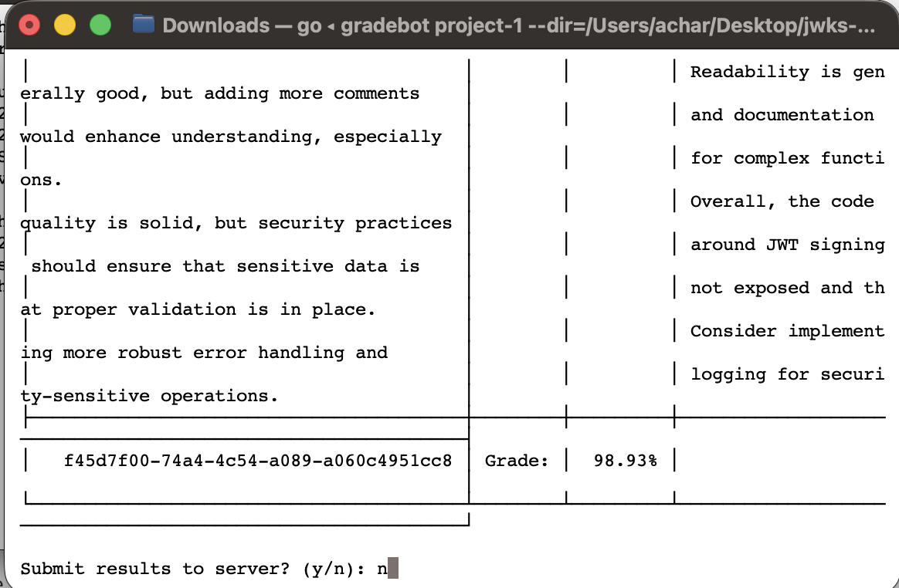
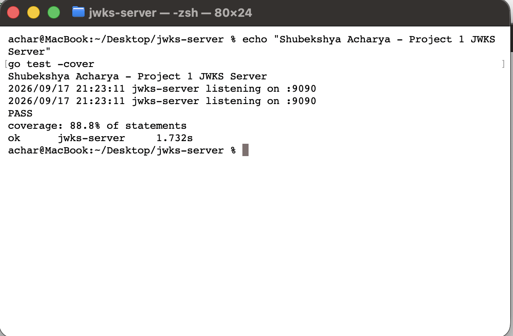

# jwks-server

A basic JWKS server written in Go for CSCE 3550 Project 1. The server generates RSA keys, provides public keys through a JWKS endpoint, and creates signed JWTs.

## Features

- Generates one valid RSA key and one expired RSA key.
- Gives each key a unique `kid`.
- Returns the valid public key from the JWKS endpoint.
- Creates a valid JWT through `/auth`.
- Creates an expired JWT when the `expired` parameter is used.
- Does not include expired keys in the JWKS response.

## Endpoints

| Method | Path | Description |
|--------|------|-------------|
| GET | `/.well-known/jwks.json` | Returns the unexpired public key in JWKS format. |
| POST | `/auth` | Returns a JWT signed with the valid key. |
| POST | `/auth?expired=true` | Returns an expired JWT signed with the expired key. |

The `/auth` endpoint does not check usernames or passwords because authentication is mocked for this project.

The JWT header contains the `kid` of the key used to sign the token. The expired key is not returned by the JWKS endpoint.

## Project Structure

```text
jwks-server/
├── go.mod
├── main.go
├── keys.go
├── jwt.go
├── handlers.go
├── main_test.go
├── keys_test.go
├── handlers_test.go
├── README.md
└── screenshots/
    ├── gradebot-results.png
    └── test-coverage.png
```

## Running the Server

Run:

```bash
go run .
```

The server runs on port `8080`.

To test the endpoints:

```bash
curl http://localhost:8080/.well-known/jwks.json
curl -X POST http://localhost:8080/auth
curl -X POST "http://localhost:8080/auth?expired=true"
```

## Testing

Run the tests with:

```bash
go test ./...
```

To check test coverage:

```bash
go test -cover ./...
```

Current test coverage is **88.8%**, which is above the required 80%.

The tests check key generation, JWK conversion, valid and expired JWTs, the JWKS endpoint, HTTP methods, and error handling.

## Screenshots

### Gradebot Results



### Test Coverage

